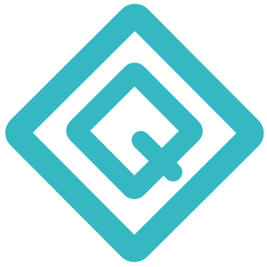

# Quantyle IDE

Quantyle is an open source integrated development environment (IDE) and programming language for crypto bots. 
This language is based on the Python programming language and was developed to simplify the process of testing and deploying trading 
bots for cryptocurrencies. Currrently the platform supports simulated trading on Coinbase Pro, Gemini, BinanceUS, and Kraken. 

For more information [contact](mailto:randy@quantyle.io)

## Requirements

Net5.0 and NodeJS v14.17.4

## Usage

1. open project `cd quantyle-ide`
2. install npm `cd frontend && npm i`
2. in a new terminal: `cd X1 && dotnet run`. It may take some time to retrieve all ticks

## Disclaimer
I am not responsible for any profits or losses made using this application. Use at your own risk.

## License

Copyright (c) Randy Lopez

Licensed under the Apache License, Version 2.0 (the "License");
you may not use this file except in compliance with the License.
You may obtain a copy of the License at

   http://www.apache.org/licenses/LICENSE-2.0

Unless required by applicable law or agreed to in writing, software
distributed under the License is distributed on an "AS IS" BASIS,
WITHOUT WARRANTIES OR CONDITIONS OF ANY KIND, either express or implied.
See the License for the specific language governing permissions and
limitations under the License.